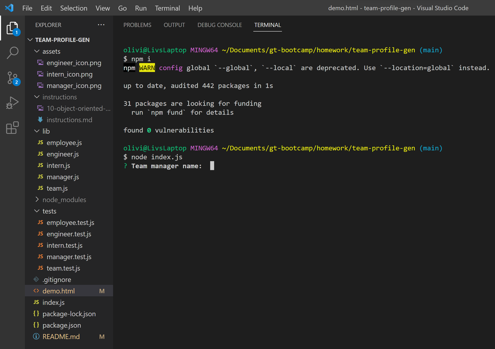
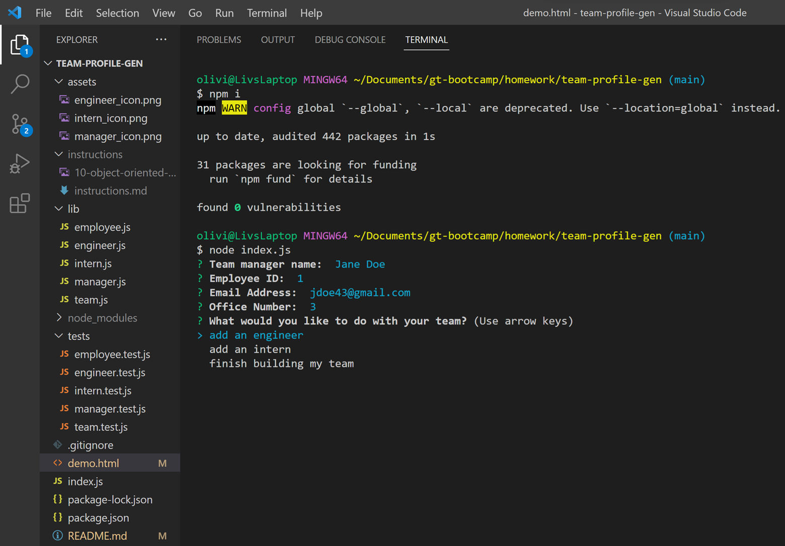
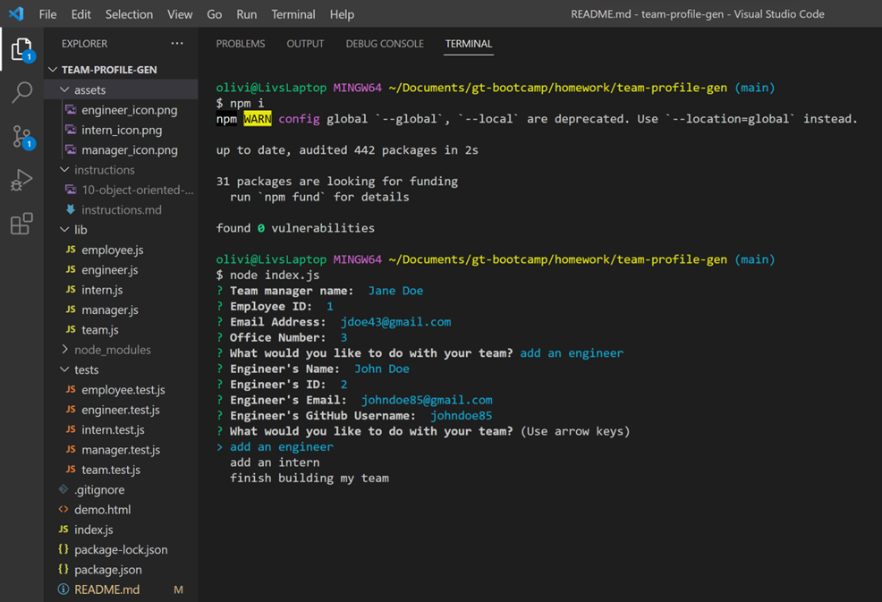
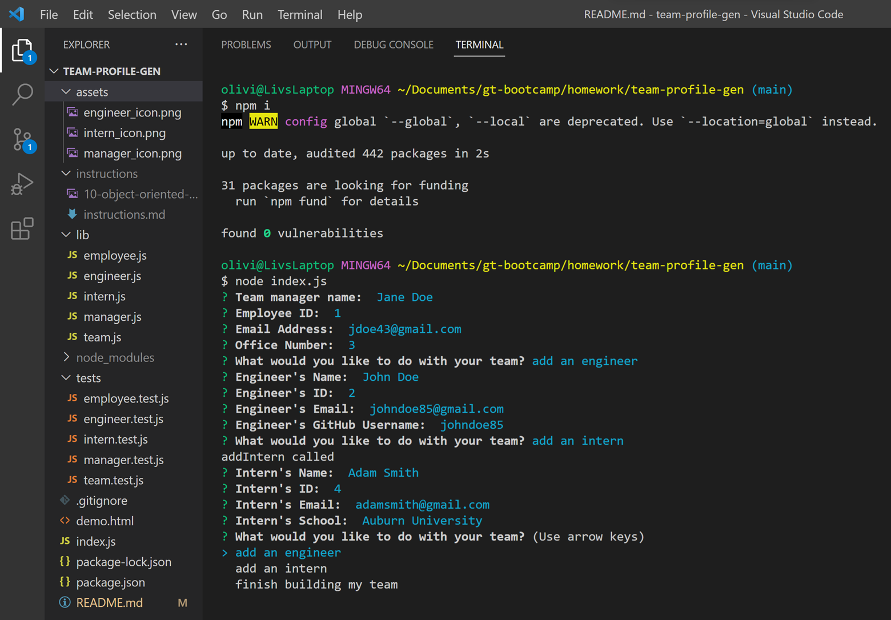
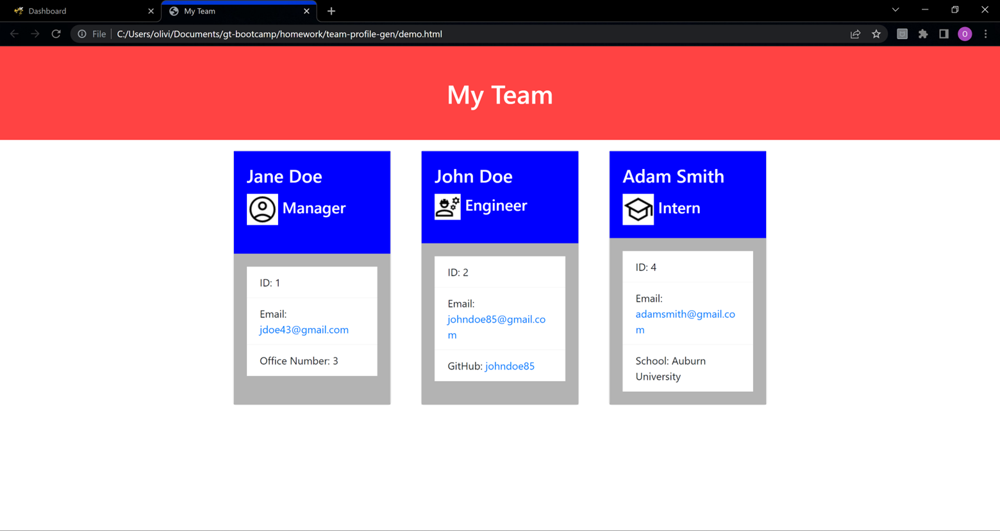

# team-profile-gen

## Installation
Before running the team-profile-gen app, the user must install the inquirer package at the version ^6.5.2. They must also install the fs package.

## Usage
To use the team-profile-gen app, the user must run the app in node.js using the command line. Once the app has begun, the user will be prompted with a series of questions allowing them to generate a profile page for their team. The user is first asked for information about the team's manager. Once the questions have been answered, the user is asked if they would like to add an engineer to the team, add an intern to the team, or finish building their team. When the user selects to add an engineer to the team, the app will ask the user a series of questions to gather the necessary data on the engineer to be added. When the user selects to add an intern to the team, the app will ask the user a series of question to gather the necessary data on the intern to be added. When the user chooses to finish building the team, an html page is created to display the team's profile. The page allows viewers to easily view the team members' information and quickly open an email to one of the employees or view the engineers' GitHub pages.

[Video Demo of App](https://drive.google.com/file/d/14nOFif9uW1_-GcgvBQr0_OP16xX8DKA8/view)
